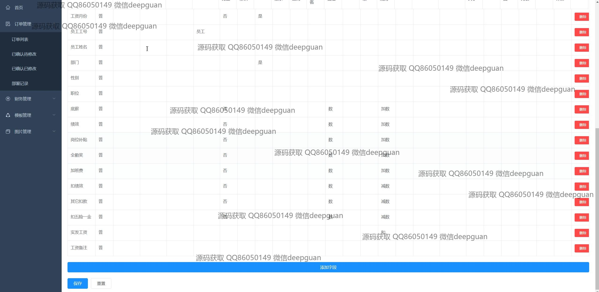
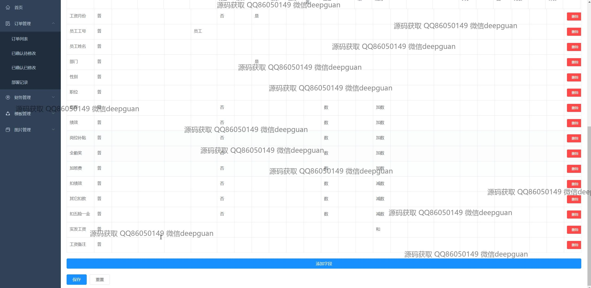
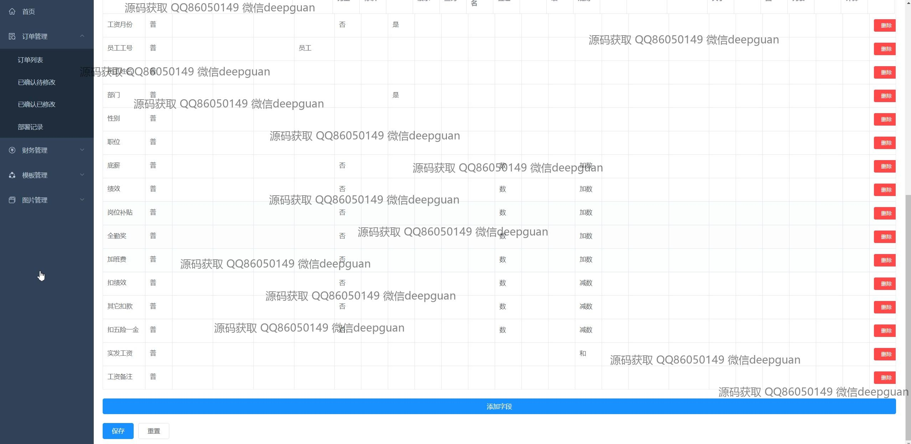
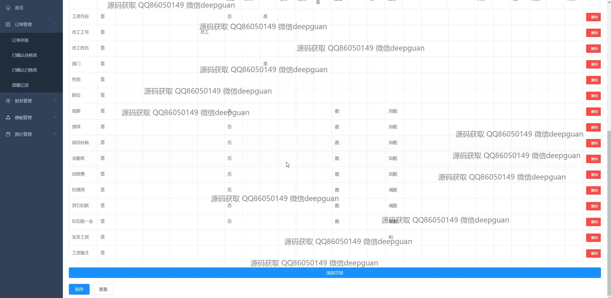
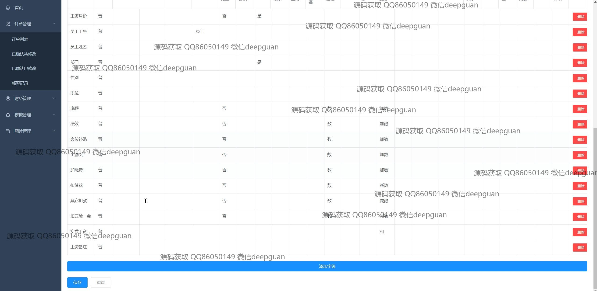
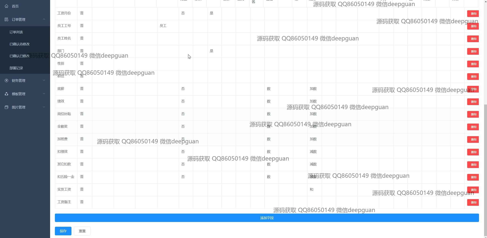
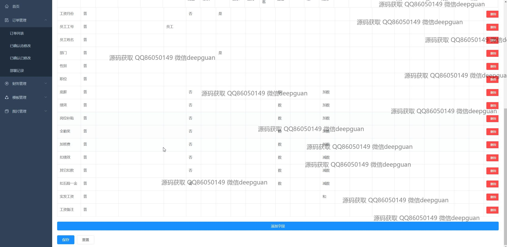
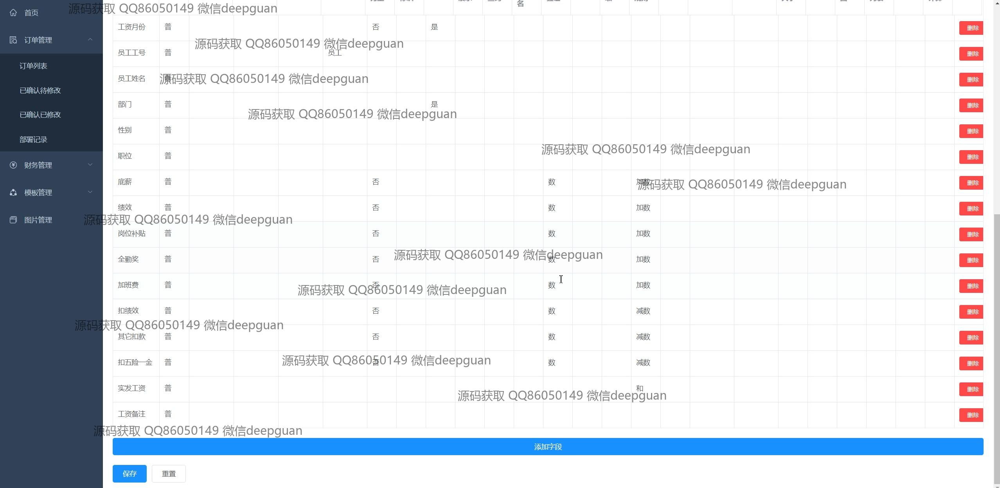
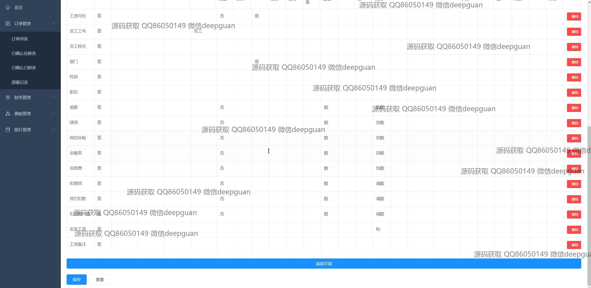

<h1 align="center">的人事工资管理系统</h1>

## 简介
人事工资管理系统：角色分为管理员、用户；功能包括订单管理、财务管理、员工工资信息管理、字段动态配置。系统支持用户登录、多用户管理，界面简洁清晰，易于操作。    --计算机毕业设计源码；毕设源码；java毕业设计源码

## 联系方式

<h3 align="center">获取完整代码与数据库文件 + 微信：deepguan QQ: 86050149 QQ群: 783742310</h3>

<h3 align="center">可帮忙远程部署 包运行成功！提供远程部署、修改代码、设计文档指导、代码讲解等服务！</h3>

## 功能介绍（完整见运行截图）
管理员：基本功能包括登录、注册和退出。管理员可以通过主页导航栏访问不同模块，如订单管理、财务管理和模板管理。系统提供详细的员工工资管理功能，包括查看和编辑工资详情，如底薪、加班费、奖金等。表格中可进行记录删除和字段添加操作，并支持数据的保存和重置。此外，管理员可以访问其他功能模块以调整系统设置和用户权限。

用户：用户可以登录和退出系统，通过导航栏进入不同模块，如查看个人工资信息。这些信息包括工资月份、员工工号、姓名、部门、职位等。此外，用户可以查看自己的工资明细，如底薪、绩效、奖金等细项，并在权限允许的情况下进行信息的编辑和管理。用户也可以使用界面上的保存和重置功能确保数据的正确性及更新。同时，系统提供简单易用的用户界面，帮助用户快速查找所需信息。

## 运行截图

本代码来源于网络,仅供学习参考使用!

